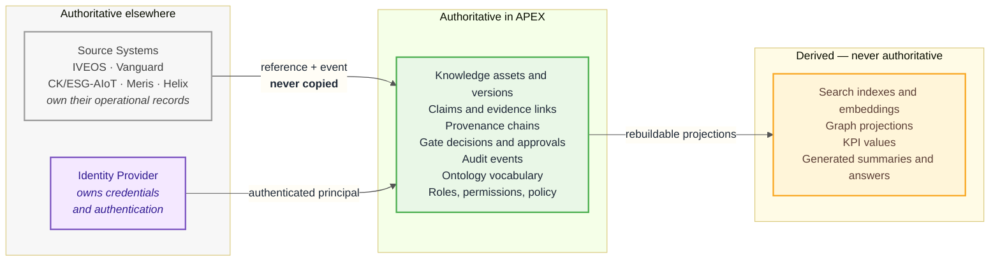

# Authority boundaries

*Authority* is the right to assert that something is true. Domain boundaries
say which code owns which tables; authority boundaries say which **system** or
**role** is entitled to make a given claim, and what everyone else must do
instead.

Getting this wrong is how governance platforms fail: not by losing data, but by
accumulating second copies of records that slowly disagree with their originals,
until nobody can say which one is right.

---

## The four rules

**1. APEX does not duplicate authoritative records.**
Where another system is the source of truth, APEX holds a reference and reacts
to events. It never holds a second copy that can silently diverge.

**2. Authorisation is evaluated at retrieval, not at presentation.**
Search, graph traversal and AI context assembly apply the same policy. A user
cannot reach through the graph, or through an agent, to content they could not
reach directly.

**3. A claim's authority is recorded, not assumed.**
Every claim names the authority behind it, the evidence supporting it, a
confidence level and a validity window. A claim whose evidence has expired is
not quietly still true.

**4. AI asserts nothing of its own.**
Generated output is a *presentation* of retrieved, cited, authorised content.
An agent may not originate a claim, approve a gate, or publish an asset.

---

## System of record

| Record | Authoritative system | APEX holds |
| --- | --- | --- |
| User credentials, authentication | Identity Provider | The authenticated principal for the request's lifetime |
| Roles, permissions, access policy | **APEX** | — |
| Operational records of source systems | IVEOS, Vanguard, CK/ESG-AIoT, Meris, Helix | A reference, plus state derived from their events |
| Knowledge assets, versions, metadata | **APEX** | — |
| Claims, evidence, authorities, validity | **APEX** | — |
| Provenance chains | **APEX** | — |
| Gate decisions, approvals, rejections | **APEX** | — |
| Audit events | **APEX** | — |
| Ontology vocabulary | **APEX** | — |
| Search indexes, embeddings, graph projections | *Derived* | Rebuildable from the above |
| KPI values | *Derived* | Value + calculation timestamp + source references |

The derived row matters. Anything marked derived must be reconstructible from
authoritative data alone. If rebuilding an index would lose information, that
information was authoritative and was stored in the wrong place.

---

## Claim authority

A published claim carries four things. Absent any of them, it does not publish.

| Element | Question it answers |
| --- | --- |
| **Authority** | Who is entitled to assert this? |
| **Evidence reference** | What backs it? |
| **Confidence** | How strongly? |
| **Validity window** | Between which dates is this assertion true? |

The validity window is what makes expiry mechanical rather than aspirational.
A claim outside its window is not "probably still fine" — it is not valid, so
**G2 Evidence Review** can no longer pass, and since **G6 Publication** requires
G2, the artefact is no longer publishable. See
[ADR-0011](../adr/0011-governance-gate-model.md).

Retention is *not* a gate in the Master Prompt's sequence. What happens to an
expired artefact — archive, supersede, retain — is a retention policy question
that remains unspecified (**A-11**).

---

## Gate authority

Gates G0–G6 are the points where authority changes hands. Each has a decision
owner; no asset advances without that owner's recorded decision.

| Gate | Decision | Authority |
| --- | --- | --- |
| G0 | **Intake** — is this sufficiently defined to enter the governed lifecycle? | Configurable |
| G1 | **Validation** — is it structurally and factually valid? | Configurable |
| G2 | **Evidence Review** — do material claims have adequate evidence and provenance? | Configurable |
| G3 | **Business Review** — is it relevant, owned and justified? | Configurable |
| G4 | **Risk & Compliance Review** — are security, compliance and operational risks acceptable? | Configurable |
| G5 | **Executive Approval** — does the accountable decision-maker approve? | Configurable |
| G6 | **Publication / Operational Release** — may this reach its audience? | Configurable |

> **Corrected in P02.** An earlier revision of this table used gate names from
> the pre-specification strategy document, in which G4 was publication. Master
> Prompt §16 names the sequence above: evidence review is **G2** and publication
> is **G6**. See [ADR-0011](../adr/0011-governance-gate-model.md), which
> supersedes ADR-0005.
>
> Authority is deliberately shown as *configurable* rather than naming roles.
> §17 requires gate authority to be configuration, not code — which is what
> resolves A-04. Separation of duties (a creator cannot approve their own
> record) is enforced in code, being the one rule unsafe to leave switchable.

---

## The AI authority boundary

This is the boundary most likely to be eroded by convenience, so it is stated
as a hard constraint on the code, not a guideline.

| An agent may | An agent may not |
| --- | --- |
| Retrieve content the requesting user is authorised to see | Retrieve anything under a broader identity than the caller's |
| Draft, summarise, classify, propose | Approve a gate, publish an asset, or alter lifecycle state |
| Cite evidence that already exists | Originate a claim, or assert one without evidence |
| Propose a relationship or classification for review | Write to the graph or ontology unreviewed |
| Execute registered tools within its policy | Call tools outside its registered set |

Two mechanisms hold this in place:

- **Agents run under the caller's principal.** There is no service identity
  with broader read access for agents to borrow. The same scope predicate that
  filters a user's search filters an agent's retrieval.
- **Every agent-proposed change enters a review queue**, not the asset. It is a
  proposal until a human with the relevant gate authority accepts it, and both
  the proposal and the decision are audited.

---

**Previous:** [Domain boundaries](domain-boundaries.md) · **Next:** [Assumptions](assumptions.md)
