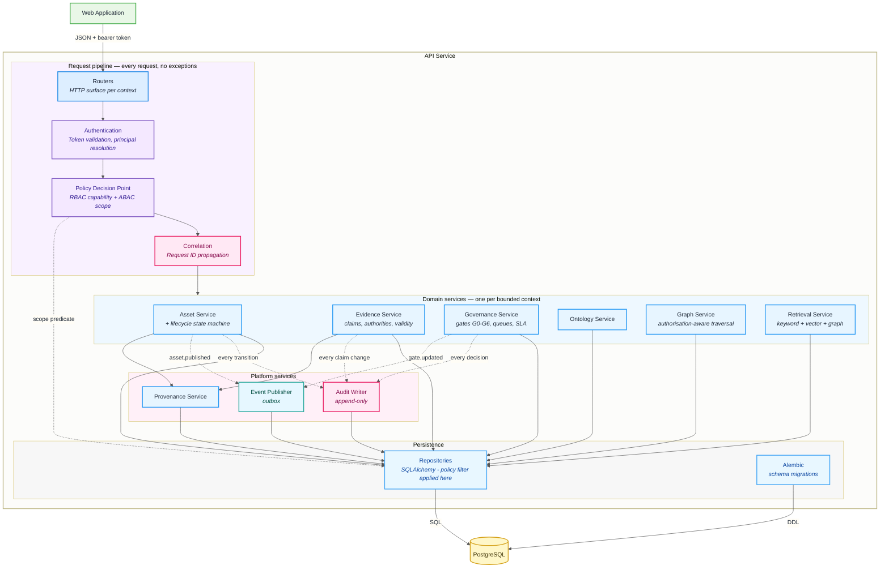

# C4 Level 3 — Components

Inside the API service.

The organising principle is that **every request passes through the same
enforcement pipeline** before it reaches domain logic, and **every state change
leaves an audit record**. Components exist to make those two statements
structurally true rather than a matter of developer discipline.

---

---

## The request pipeline

| Component | Responsibility | Introduced |
| --- | --- | --- |
| **Routers** | HTTP surface, request/response schemas. No business logic. | Commit 001 |
| **Authentication** | Validates the bearer token, resolves the calling principal. Rejects unauthenticated calls before any domain code runs. | Commit 004 |
| **Policy Decision Point** | Evaluates RBAC capability (*may this role do this at all?*) and ABAC scope (*which rows, for this tenant, audience, geography and classification?*). Emits a scope predicate. | Commits 004–005 |
| **Correlation** | Assigns or propagates a correlation ID onto the request, every audit event and every integration event it causes. | Commit 013 |

The PDP does not return a boolean. It returns a **scope predicate** that the
repository layer applies to the query itself. This is the mechanism behind
[ADR-0004](../adr/0004-authorization-at-retrieval.md): unauthorised rows are
never loaded, so they cannot be leaked by a later code path that forgets to
check — including graph traversal and AI context assembly.

### The ABAC pipeline

Policy evaluation is four separable stages, each in its own module, in
dependency order:

| Stage | Module | Responsibility |
| --- | --- | --- |
| **Policy definition** | `app/policy/models.py` | Tenants and rules, as tenant-scoped data. A condition names an attribute key, an operator and literal operands — it does not know what the attribute means. |
| **Attribute resolution** | `app/policy/attributes.py` | Resolvers turn a request into facts, each owning one namespace so two can never contest an attribute. |
| **Policy decision** | `app/policy/engine.py` | A **pure function** of request, attributes and policies. No I/O, no session, no globals beyond two registries. |
| **Enforcement** | `app/policy/enforcement.py` | Turns a decision into an HTTP outcome. Default-deny: anything but `ALLOW` refuses. |

The separation is what makes the evaluator exhaustively testable without a
database or a web framework, and it is also what keeps tenant isolation
intact — the engine never loads anything, so what it sees is entirely
determined by the service layer, which loads under `tenant_scope`.

Two registries are the extension points. New attribute domains arrive as
**registered resolvers**; new comparisons — including any ordering-aware one —
arrive as **registered operators**. Neither requires changing the evaluator or
the schema, which is how classification, audience, geography and organisation
can be added once their semantics are specified.

---

## Domain services

One per bounded context, each owning its own tables. See
[Domain boundaries](domain-boundaries.md) for the full context map and the
rules for crossing between them.

| Component | Responsibility | Introduced |
| --- | --- | --- |
| **Asset Service** | Asset entities, versions, metadata, content hashes. Hosts the lifecycle state machine; transitions are the only way asset state changes. | Commits 007, 009 |
| **Evidence Service** | Claims, evidence references, authorities, confidence, validity windows. Enforces that unevidenced claims cannot publish. | Commit 010 |
| **Governance Service** | Gates G0–G6, review and approval queues, escalation, SLA and expiry. | Commit 012 |
| **Ontology Service** | The shared vocabulary every other context references. | Commit 006 |
| **Graph Service** | Nodes, relationships and traversal — always under the caller's scope predicate. | Commit 014 |
| **Retrieval Service** | Keyword, vector and hybrid retrieval, ranked and permission-filtered. | Commits 016–018 |

---

## Platform services

| Component | Responsibility | Introduced |
| --- | --- | --- |
| **Audit Writer** | Append-only event log: actor, resource, action, before/after, correlation ID, IP, user agent. No update or delete path exists. See [ADR-0007](../adr/0007-append-only-audit-log.md). | Commit 013 |
| **Event Publisher** | Writes integration events through a transactional outbox, so an event is never published for a transaction that rolled back. | Commit 020 |
| **Provenance Service** | Assembles the source → version → evidence → approval chain for any asset. | Commit 011 |

---

## Persistence

Repositories are the only component that talks to the database. They accept
the scope predicate from the PDP and apply it to every query returning
governed rows. Domain services never construct raw queries, which is what keeps
the authorisation guarantee from depending on reviewer vigilance.

Alembic owns schema change. Migrations are reviewed like code and are part of
the pre-commit validation gate from Commit 003 onward.

---

## What is deliberately not here yet

The AI and agent components (model registry, prompt registry, tool registry,
agent orchestrator, evaluation) are **not** shown at this level. They are
introduced in Commits 026–028 and their internal decomposition depends on
requirements not yet available. Sketching them now would put shapes in a
diagram that later code would have to either honour or quietly contradict.

> Recorded as **A-06** in [assumptions.md](assumptions.md).

---

**Previous:** [C4 Level 2 — Containers](containers.md) · **Next:** [Domain boundaries](domain-boundaries.md)
