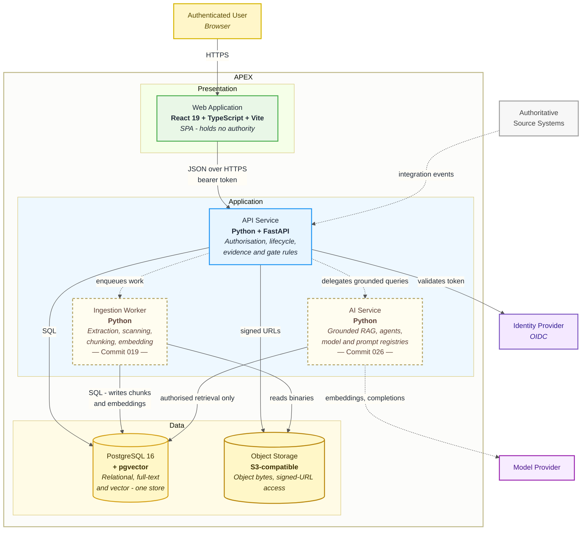

# C4 Level 2 — Containers

The deployable units inside APEX and how they communicate.

Node borders distinguish what exists today from what is planned:
**solid** containers are running as of Commit 001, **dashed** containers arrive
in a later increment, annotated with the commit that introduces them.

---

---

## Containers

| Container | Technology | Responsibility | Status |
| --- | --- | --- | --- |
| **Web Application** | React 19, TypeScript, Vite | Renders the UI. Holds no authority: it displays what the API returns and hides nothing the API would have disclosed. | Commit 001 |
| **API Service** | Python 3.11+, FastAPI | The single policy decision point. Owns authorisation, asset lifecycle transitions, evidence rules, gate progression and audit writes. | Commit 001 |
| **PostgreSQL** | Postgres 16 + `pgvector` | System of record. Relational data, full-text indexes and vector embeddings in one store so retrieval and permission filtering share a query plane. | Provisioned Commit 001, schema Commit 003 |
| **Object Storage** | S3-compatible (MinIO locally) | Object bytes. Access only via server-issued, short-lived signed URLs; keys are generated by APEX and never supplied by a caller. Bucket selection sits behind a resolver — the seam a data-residency policy would replace (A-19). | ✅ Commit 008 |
| **Ingestion Worker** | Python | Out-of-band document extraction, malware and sensitive-data scanning, chunking, embedding generation. | Commit 019 |
| **AI Service** | Python | Grounded retrieval, citation assembly, bounded agent execution. Reads only through the authorisation layer. | Commit 026 |

---

## Why the API service is a single container

APEX is deployed as one API process containing many bounded contexts, not as a
fleet of services. The contexts are separated in code and in schema, not across
a network. The reasoning — and the conditions under which a context should be
extracted — is in
[ADR-0003](../adr/0003-modular-monolith-with-bounded-contexts.md).

The short version: the platform's central invariants are *cross-cutting*. A
permission check spans identity, policy, asset and audit; a gate transition
spans governance, evidence and audit. Enforcing those across process boundaries
means distributed transactions, or accepting that the invariants can be
violated in the window between calls. Neither is acceptable for a system whose
purpose is provable governance.

The worker and AI service are separated because their failure modes and
scaling profiles genuinely differ: a stuck PDF extraction or a slow model call
must not consume request-handling capacity.

---

## Communication

| Path | Protocol | Notes |
| --- | --- | --- |
| Browser → Web App | HTTPS | Static bundle served by nginx in production. |
| Web App → API | JSON / HTTPS | Bearer token on every call. No session affinity. |
| API → PostgreSQL | SQL | Connection pooled. Every query that returns assets is policy-filtered. |
| API → Object Storage | S3 API | Clients never receive raw credentials — only short-lived signed URLs. |
| API → Worker | Queue | Transport decided in Commit 019; the event contract (Commit 020) is written so the transport can change without touching producers or consumers. |
| Sources → API | Integration events | Idempotent, with event/correlation/causation IDs and a dead-letter path. |

---

## Deployment

The Compose stack (`docker-compose.yml`) runs postgres, minio, backend and
frontend for local development. Production packaging exists in both Dockerfiles
as a separate `production` target — nginx serving the static bundle, uvicorn
without reload, non-root user.

Local and production storage configuration are separated by configuration, not
by code: MinIO is reached through the same `APEX_S3_*` settings that would point
at AWS S3 or an equivalent. The only difference is `APEX_S3_FORCE_PATH_STYLE`,
which MinIO requires and AWS does not. There is no development-only code path
in the storage package, and nothing silently falls back to in-memory storage —
an upload that appears to succeed and vanishes is worse than one that fails.

> **Assumption — pending master prompt.** The target production environment
> (cloud provider, orchestrator, regions, tenancy isolation model) is not yet
> specified. Nothing in this layer depends on that choice: all containers are
> stateless apart from the two data stores. Recorded as **A-05** in
> [assumptions.md](assumptions.md).

---

**Previous:** [C4 Level 1 — Context](context.md) · **Next:** [C4 Level 3 — Components](components.md)
