```mermaid
---
config:
  theme: base
  look: classic
  themeVariables:
    fontFamily: Segoe UI, Calibri, Arial
    fontSize: 15px
    background: "#FFFDF6"
    primaryColor: "#EAF5E2"
    primaryTextColor: "#1F2937"
    primaryBorderColor: "#4CAF50"
    secondaryColor: "#FFF7CC"
    tertiaryColor: "#F6F2FF"
    lineColor: "#555555"
    textColor: "#222222"
    edgeLabelBackground: "#FFFDF6"
    clusterBkg: "#FFF9D6"
    clusterBorder: "#D9C97C"
    nodeBorder: "#888888"
    actorBkg: "#FFF4B5"
    actorBorder: "#C8A000"
    noteBkgColor: "#FFF9D6"
    noteBorderColor: "#C7B248"
---
flowchart TB
    subgraph people["People"]
        direction TB
        steward["Knowledge Steward<br/><i>Curates, submits and maintains assets</i>"]
        approver["Domain Owner / Approver<br/><i>Clears governance gates G0-G6</i>"]
        consumer["Knowledge Consumer<br/><i>Searches, traces and reuses assets</i>"]
        leader["Executive<br/><i>Reads KPIs, trends and readiness</i>"]
        admin["Platform Administrator<br/><i>Manages identity, roles and policy</i>"]
    end

    apex["<b>APEX</b><br/>Enterprise knowledge, governance<br/>and intelligence platform<br/><i>System of record for knowledge<br/>assets and their evidence</i>"]

    subgraph identity["Identity"]
        idp["Enterprise Identity Provider<br/><i>OIDC - authenticates people</i>"]
    end

    subgraph authoritative["Authoritative source systems"]
        direction TB
        iveos["IVEOS"]
        vanguard["Vanguard"]
        ckesg["CK / ESG-AIoT"]
        meris["Meris"]
        helix["Helix"]
    end

    subgraph supporting["Supporting services"]
        direction TB
        objstore["Object Storage<br/><i>S3-compatible - asset binaries</i>"]
        modelprov["Model Provider<br/><i>Embeddings and generation</i>"]
    end

    steward -->|"submits and curates assets"| apex
    approver -->|"reviews, approves, rejects"| apex
    consumer -->|"searches, traces, reuses"| apex
    leader -->|"reads dashboards"| apex
    admin -->|"administers"| apex

    apex -->|"authenticates via OIDC"| idp

    iveos -.->|"events + references"| apex
    vanguard -.->|"events + references"| apex
    ckesg -.->|"events + references"| apex
    meris -.->|"events + references"| apex
    helix -.->|"events + references"| apex

    apex -->|"stores and retrieves binaries"| objstore
    apex -->|"embeds and generates, grounded"| modelprov

    classDef user        fill:#FFF6C9,stroke:#D6B500,color:#5A4A00,stroke-width:2px;
    classDef application fill:#E9F7E7,stroke:#4CAF50,color:#1F2937,stroke-width:2px;
    classDef external    fill:#F7F7F7,stroke:#9E9E9E,color:#424242,stroke-width:2px;
    classDef security    fill:#F4E8FF,stroke:#7E57C2,color:#311B92,stroke-width:2px;
    classDef storage     fill:#FFF7C8,stroke:#B8860B,color:#3B2F00,stroke-width:2px;
    classDef ai          fill:#F7ECFF,stroke:#9C27B0,color:#4A148C,stroke-width:2px;

    class steward,approver,consumer,leader,admin user;
    class apex application;
    class idp security;
    class iveos,vanguard,ckesg,meris,helix external;
    class objstore storage;
    class modelprov ai;

    style people fill:#FFFBE6,stroke:#D9C97C,stroke-width:1px
    style identity fill:#F9F1FF,stroke:#D9C97C,stroke-width:1px
    style authoritative fill:#F7F7F7,stroke:#D9C97C,stroke-width:1px
    style supporting fill:#EEF8FF,stroke:#D9C97C,stroke-width:1px
```

# C4 Level 1 — System context

Who uses APEX, and which systems it depends on.

> **Boundary rule.** APEX is the system of record for *knowledge assets and the
> evidence behind them*. It is not the system of record for the operational
> data held in the systems on its right-hand edge. See
> [Authority boundaries](authority-boundaries.md).

---

---

## Actors

| Actor | Needs from APEX | Primary gates touched |
| --- | --- | --- |
| **Knowledge Steward** | Register assets, attach evidence, maintain metadata, respond to review findings | G0, G1 |
| **Domain Owner / Approver** | A queue of items awaiting decision, with enough evidence visible to decide | G1–G4 |
| **Knowledge Consumer** | Find the right asset, confirm it is current, see what backs its claims | — (read path) |
| **Executive** | Aggregate readiness, coverage, reuse and trend posture | G5 |
| **Platform Administrator** | Manage users, roles, permissions and access policy | — (control plane) |

These are *roles*, not job titles — one person commonly holds several. The
concrete role and permission set is defined in Commit 004 (identity and RBAC);
the mapping of roles to specific gates is defined in Commit 012.

---

## External systems

| System | Relationship | Direction |
| --- | --- | --- |
| **Enterprise Identity Provider** | Authenticates people. APEX authorises them; it does not own credentials. | APEX → IdP |
| **IVEOS, Vanguard, CK/ESG-AIoT, Meris, Helix** | Authoritative for their own operational records. APEX holds references and reacts to events. | Systems → APEX |
| **Object Storage** | Holds asset binaries. The database holds metadata, content hashes and references only. | APEX ↔ Storage |
| **Model Provider** | Generates embeddings and grounded completions. Receives only content the requesting user is already authorised to see. | APEX → Provider |

> **Assumption — pending master prompt.** The five source systems are named in
> the development plan, but their domains, record types, interfaces and
> ownership are not yet specified. This diagram therefore shows *that* they are
> authoritative and integrate by reference and event — which the plan states
> explicitly — without asserting *what* they are authoritative for. Recorded in
> [assumptions.md](assumptions.md) as **A-03**.

---

## What this diagram commits us to

Three properties are fixed at this level and constrain every layer beneath it:

1. **APEX never becomes a second copy of an upstream record.** Integration is
   by reference and event. See [ADR-0006](../adr/0006-integration-by-reference-and-event.md).
2. **Authentication is delegated; authorisation is not.** The IdP establishes
   *who* the caller is. Every decision about *what they may see* is made inside
   APEX, at retrieval time. See [ADR-0004](../adr/0004-authorization-at-retrieval.md).
3. **The model provider is downstream of authorisation, never upstream.**
   Content reaches a model only after the requesting user's access has been
   evaluated, so a generated answer cannot leak what a direct query would have
   withheld.

---

**Next:** [C4 Level 2 — Containers](containers.md)
