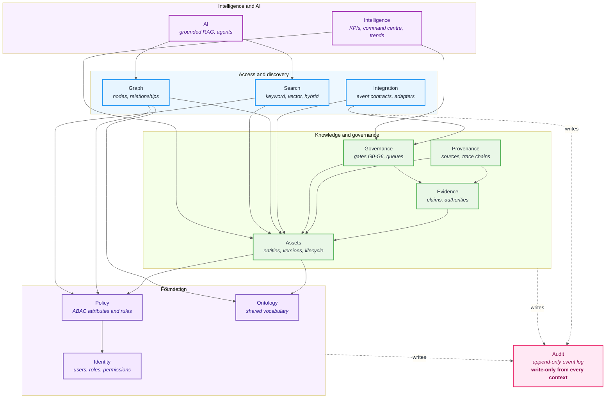

# Domain boundaries

APEX is organised by bounded context. Each context owns its tables, exposes a
service interface, and is the only code permitted to write to what it owns.

This document defines the contexts, the permitted dependency directions, and
what "crossing a boundary" is allowed to mean.

---

## Context map

Dependencies point **downward only**. A context may call the interface of a
context below it; it may never call upward, and it may never read another
context's tables directly.



---

## Contexts

| Context | Owns | Depends on | Commit |
| --- | --- | --- | --- |
| **Identity** | Users, roles, permissions, role/permission mappings | — | 004 |
| **Policy** | Tenant, organisation, audience, geography, classification; policy rules | Identity | 005 |
| **Ontology** | Domain, persona, problem, platform, application, device, sensor, use case, KPI, ROI, owner; their versions and relationships | — | 006 |
| **Assets** | Asset entities, versions, types, metadata, content hashes, lifecycle state | Ontology, Policy | 007–009 |
| **Evidence** | Claims, evidence references, authorities, confidence, validity windows | Assets | 010 |
| **Provenance** | Sources, version history, trace chains | Assets, Evidence | 011 |
| **Governance** | Gate definitions G0–G6, review/approval queues, escalations, SLAs, expiry | Assets, Evidence | 012 |
| **Audit** | Immutable audit events | *(written to by all; depends on none)* | 013 |
| **Graph** | Graph nodes and relationships, traversal | Assets, Ontology, Policy | 014–015 |
| **Search** | Full-text indexes, chunks, embeddings, ranking | Assets, Policy | 016–018 |
| **Integration** | Event contracts, outbox, external adapters | Assets, Governance | 020–021 |
| **Intelligence** | KPI definitions and values, command centre, trend radar | Assets, Governance | 022–024 |
| **AI** | Model/prompt/tool registries, RAG pipeline, agents | Search, Graph | 025–028 |

> **Assumption — pending master prompt.** The ontology entity list above is
> taken verbatim from the development plan's Commit 006 deliverables. Their
> attributes, cardinalities and relationship semantics are not yet specified,
> so no schema is asserted here. Recorded as **A-02** in
> [assumptions.md](assumptions.md).

---

## Crossing a boundary

Exactly three mechanisms are permitted.

**1. Call the owning context's service interface.**

```python
# Correct — Governance asks Evidence a question it owns the answer to.
if not evidence_service.has_valid_evidence(asset_id, as_of=now):
    raise GateBlocked(gate="G2", reason="claims lack valid evidence")
```

```python
# Forbidden — reaching into another context's tables.
rows = session.query(EvidenceReference).filter_by(asset_id=asset_id).all()
```

The second form compiles, passes tests, and quietly makes Evidence's
invariants unenforceable: validity windows, authority checks and confidence
thresholds all live in the service, not the table.

**2. Reference by identifier.** A context may store another context's ID. It
may not duplicate that entity's attributes. A denormalised copy is a copy that
will eventually disagree with the original, and there is no way to tell which
one a reviewer was looking at.

**3. React to an integration event.** For anything asynchronous, or crossing
the system boundary entirely. Events carry event, correlation and causation
IDs and are idempotent by contract (Commit 020).

---

## Why Audit is shaped differently

Every context writes to Audit; Audit depends on nothing. That asymmetry is
deliberate — it means no context can be tempted to read audit history to make a
decision, which would make the log load-bearing for behaviour rather than a
record of it. The log is written, never consulted by domain logic, and never
updated or deleted. See [ADR-0007](../adr/0007-append-only-audit-log.md).

---

## Enforcement

Today these rules are enforced by review. As the contexts land, they become
mechanical:

- one Python package per context under `backend/app/`, with models private to it
- service interfaces as the package's public surface
- an import-linter contract in CI failing any upward or lateral import
- repository-level tests asserting that a context's tables are unreachable
  from another context's session

The import contract is added with the first commit that introduces a second
context with a real dependency (Commit 005).

---

**Previous:** [C4 Level 3 — Components](components.md) · **Next:** [Authority boundaries](authority-boundaries.md)
